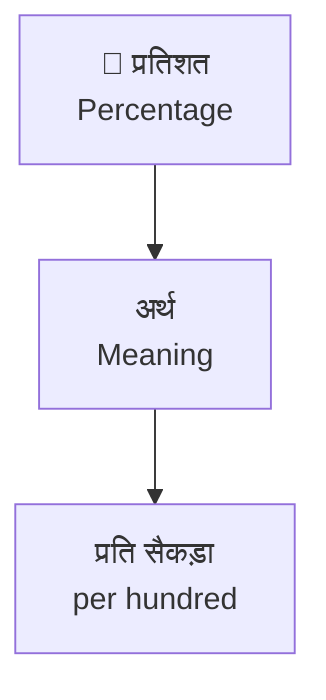

# 📚 BOOK_AGENT — किताबें पूरी करने का runbook (किसी भी AI के लिए)

> **मालिक के लिए — बस इतना करें:** repo को Antigravity (या Claude Code / Cursor / कोई भी AI जिसके पास
> files + terminal हों) में खोलें और chat में यह एक लाइन लिखें:
>
> ```
> study_station/books/BOOK_AGENT.md पढ़ो और उसके हिसाब से "book" चलाओ
> ```
>
> विकल्प: `book 3` = 3 अध्याय करके रुको · `book <अध्याय का path>` = सिर्फ़ वही अध्याय ·
> `book status` = सिर्फ़ हालत बताओ, कुछ मत लिखो।
> हर अध्याय के बाद AI खुद जाँचता है, commit करता है और हिंदी में बताता है। एक chat में 1–3 अध्याय ठीक हैं;
> chat लंबी हो जाए तो नई chat खोलकर वही लाइन फिर लिखें — काम वहीं से आगे चलेगा (हालत files में रहती है)।

---

## 🤖 AI के लिए निर्देश (English, exact — follow every step, in order)

You are completing a bilingual (Hindi + English) exam-prep book series for Indian government-exam aspirants
(SSC GD/MTS/CHSL/CGL, Railway, Bank, State exams). Students will trust every line. **Accuracy beats length.
A missing fact is fine; a wrong fact is not.** Work one chapter at a time. Never skip the checks.

The command you received is one of:
- `book` → loop: do the next chapter, check, commit, repeat until you have done **3 chapters** or the context is
  getting long, then report and stop.
- `book N` → same, but stop after N chapters.
- `book <path to a Chapter_NN_* folder>` → only that chapter.
- `book status` → run step 1's status command, report, write nothing.

### Step 0 — Setup (once per machine; skip what already works)
```bash
cd <repo>/study_station/v2
python -m venv .venv                       # Windows: py -m venv .venv
. .venv/bin/activate                       # Windows: .venv\Scripts\activate
pip install -r requirements.txt
python -m app.bookcheck --status           # must print a table, not an error
git fetch origin
git checkout claude/elegant-rubin-sgov1q   # the books branch (until the owner merges it; then use the branch
                                           # the owner names). Never work on or push to main.
git pull --rebase                          # get the latest work before starting
```
All `python -m app.…` commands below run **from `study_station/v2/`** (paths to books are `../books/...`).

### Step 1 — Pick the chapter
```bash
python -m app.bookcheck --next
```
It prints `NEXT: <chapter folder>`, `MODE: write|fix`, and the list of `todo` / `problem` lines.
(If the owner named a chapter, use that one and run `python -m app.bookcheck <that folder>` instead.)
`ALL DONE` → report and stop. The order of books is `books/QUEUE.txt` — do not change it.

### Step 2 — Read before writing (do not skip)
1. `study_station/books/BOOK_RULES.md` — the rules. **They override every prompt file.**
2. `<chapter>/Prompts/Chapter_Intro_Prompt.txt`, then the prompt file of every section you will write
   (`<chapter>/Prompts/<Section>.txt`). The prompt is the spec (topics to cover, number of items, difficulty
   split) wherever it does not conflict with BOOK_RULES.md. English books keep a longer spec in
   `Prompts/Master_Prompt_hi.txt` / `Master_Prompt_en.txt`.
3. A finished chapter as the **layout model (GOLD)** — copy its structure, never its facts:
   - GK books: `books/10th_Level/GK/Foundation_10th_GK_WorldClass/Chapter_07_States_Rivers`
   - Maths/Reasoning/English: a chapter of the same book that `bookcheck` reports `OK`; if none,
     use the GK GOLD for layout and the subject's own prompts for content.
4. In **fix** mode: every finished section of the chapter first — keep what is good.

### Step 3 — Write (where, what, in which order)
**Where:** every finished section is one `.txt` file in the **chapter folder itself**
(`<chapter>/Content_hi.txt`, `<chapter>/Practice_en_Set_01.txt`, …) plus `<chapter>/chapter.json`.
**Never write inside `Prompts/`. Never touch any other folder.**

**Order** (one file at a time; save each file before starting the next):
1. `chapter.json` — `python -m app.bookcheck --fill-meta <chapter>` creates it; then open it and check:
   ```json
   {"title_hi": "…", "title_en": "…", "topic": "<subject>/<topic-slug>", "type": "static",
    "status": "draft", "as_of": null, "notes": ""}
   ```
   `topic` must be one of the slugs in `study_station/v2/app/catalog.py` (`TOPICS`), written as
   `subject/slug` (e.g. `ga/indian-geography`, `quant/percentage`, `reasoning/analogy`). Pick the closest.
   `status` stays `"draft"` — **only a human sets `"reviewed"`.** `as_of` = the latest year you verified for
   facts that change over time (awards, sports, schemes, indices, counts); list those facts in `notes`.
2. `Content_en.txt`, then `Content_hi.txt` (the same content in natural Hindi — not word-by-word).
3. The other sections the chapter's prompts ask for, each `_en` then `_hi`: `Key_Facts`, `Feynman`,
   `Flashcards`, `Memory_Hooks` (GK) / `Short_Tricks` / `Important_Formulas` (Maths) /
   `Important_Rules` (Reasoning, English), `PYQ`.
4. `Mind_Map.txt` (or `Mind_Map_hi.txt` + `Mind_Map_en.txt` if the prompts ask for two).
5. Practice: for N = 1…6: write `Practice_en_Set_0N.txt`, then `Practice_hi_Set_0N.txt` as its **exact
   translation**, then run `python -m app.bookcheck <chapter>` and fix that set before starting the next one.

**Exact formats** (the app's parser reads these — any other shape is lost):

Practice set (Set N has questions (N−1)×25+1 … N×25):
```
Questions 1–20: Easy | Questions 21–25: Medium

1. Question text? (statements, if any, each on its own line)
(a) option (b) option (c) option (d) option
Answer: (c)
Solution: 1–3 sentences — why (c) is right, and why the tempting wrong option is wrong.
Source: NCERT Class 9 Geography, Ch 3 Drainage
```
Hindi set: `प्रश्न 1–20: आसान | प्रश्न 21–25: मध्यम`, `उत्तर: (c)`, `हल: …`, `स्रोत: NCERT कक्षा 9 भूगोल`.
Rules for every question: exactly 4 different options; exactly one correct; no "all/none of the above";
self-contained (never "as above / same arrangement / पिछले प्रश्न"); correct letters spread over a–d
(no letter correct more than ~9 times in a set); the hi file = the en file translated, **same order, same option
order, same answer letter**; the solution must end on the correct value (not the trap value).

Mind map:
````

````
Labels in double quotes, `<br>` for a new line, no other text before or after the block.

Flashcards: `कार्ड 1` / `सामने: …` / `पीछे: …` (English: `Card 1` / `Front: …` / `Back: …`), 15–20 cards.

Headings in sections: `## …`, lists with `- `, tables as `| a | b |` rows. Plain text — no HTML.

### Step 4 — Hard rules (STRICT — breaking any one = the chapter is rejected)
1. **Facts:** only stable, textbook-verifiable facts (NCERT, `*.gov.in`, `*.nic.in`, the official body's own site).
   Not sure → look it up on an official/NCERT source, or leave it out. Never invent numbers, percentages,
   counts, ranks, dates or quotes.
2. **Time-sensitive facts** (awards, sports results, schemes, office holders, records, counts of sites/reserves):
   always with the year ("2024 में …"), verified on an official source, and listed in `chapter.json` notes.
   Never "the current/present X is …" without a date.
3. **PYQ section = pattern analysis in words** (which sub-topics recur, question types, examiner traps).
   **Forbidden:** year-wise frequency tables, "weightage %", "N questions in last 10 years", "approximate count".
4. **Sources:** `Source:` names the textbook/official body, or `PYQ-style`. An exam + year (e.g.
   "SSC CGL 2019 Tier-I") is allowed **only with the URL of the official question paper / answer key on the same
   line**. Never write UPSC in a 10th-level book.
5. **Language:** `_hi` files in natural Devanagari Hindi (technical terms may keep English in brackets);
   `_en` files in plain Indian-exam English. Never mix a whole section of the other language in.
6. **No chat debris:** no "Here is…", "Sure!", "I hope this helps", "text / Copy / Download / Diagram",
   no notes about the prompt or about yourself. Files must be paste-ready book text.
7. **Copyright:** write in your own words. Never copy paragraphs from coaching sites, guides or other books.
8. **Only inside the chapter folder.** Do not edit `Prompts/`, other chapters, `BOOK_RULES.md`, `QUEUE.txt`,
   anything in `v2/` (code, tests, `bookcheck`), or any database. **Never change a check to make it pass.**
9. **Current-affairs chapters** (`chapter.json` `"type": "dynamic"`, folders named `*Current_Affairs*`) are
   never written — the app shows live news there.
10. **Never** set `"status": "reviewed"`, delete a chapter, rename folders, force-push, or push to `main`.

### Step 5 — Check (all must pass before committing)
A. Machine check — must print `OK`:
```bash
python -m app.bookcheck ../books/<…>/Chapter_NN_Name
```
`todo` = a section is still missing. `problem` = fix it (the message says what). Repeat until `OK`.
Do **not** edit bookcheck, and do not "fix" a problem by deleting good content.

B. Your own review (bookcheck cannot see these — do them every time):
- Re-solve **5 random questions from every practice set** without looking at the key; every key must match.
  For maths/reasoning re-do the calculation; for GK re-check the fact.
- Every date, number and name in `Key_Facts` — verified or removed.
- Open `Content_hi.txt` and read 10 lines: natural Hindi? same meaning as the English?
- Every time-sensitive fact has a year and is listed in `chapter.json` notes; `as_of` set.
- `PYQ_hi/en`: no tables of counts/percentages; no exam/year sources without a URL.

C. Whole repo still healthy (fast, run once per chapter):
```bash
python -m pytest -q tests/test_books.py tests/test_bookcheck.py
```

### Step 6 — Commit and push (only a chapter that passed Step 5)
```bash
cd <repo>
git add study_station/books/<…>/Chapter_NN_Name          # ONLY this chapter folder
git status                                              # nothing else may be staged
git commit -m "Books: <Level> <Subject> chapter NN <English title> (draft, bookcheck OK)"
git pull --rebase && git push
```
If the push is rejected, `git pull --rebase` and push again — never `--force`. If a rebase conflicts in a file
outside your chapter, stop and report; do not resolve someone else's files.
If you must stop in the middle of a chapter: do **not** commit it; report which files are done.

### Step 7 — Next / stop
Go back to Step 1 until the command's chapter count is done. Start a new chat if the conversation is long
(the next run continues from `--next`).

### Step 8 — Report (in Hindi, short)
```
📚 किताब अपडेट
✅ पूरे हुए: <book> अध्याय NN <नाम> (commit <hash>)
🔎 जाँच: bookcheck OK · हर set से 5 सवाल दोबारा हल किए · <N> तथ्य official source से जाँचे
⚠️ शक/ध्यान दें: <कोई तथ्य जिस पर शक हो, या "कुछ नहीं">
⏭️ अगला: <python -m app.bookcheck --next का NEXT>
📊 कुल: <python -m app.bookcheck --status की आख़िरी लाइन>
```

### When stuck
- A fact cannot be verified → leave it out and mention it under ⚠️.
- The prompt asks for something BOOK_RULES.md forbids → follow BOOK_RULES.md and mention it.
- `bookcheck` reports a problem you think is wrong → do not change the check; leave the chapter uncommitted and
  report the exact message.
- `chapter.json` topic: no catalog slug fits → pick the closest one and mention it under ⚠️.
